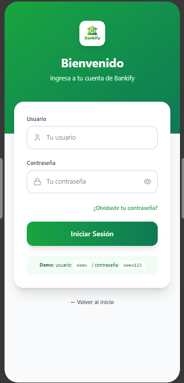

# 📄 Requerimientos del Sistema

## 1. Lista general de requerimientos

El sistema de Bankify tiene los siguientes requerimientos (descripción a alto nivel):

### 1.1 Requerimientos funcionales

El sistema de Bankify debe tener la capacidad de:

1. Permitir la autenticación de usuarios mediante usuario y contraseña.
2. Permitir crear, activar, inactivar y actualizar clientes según el rol autorizado.
3. Permitir crear, activar, inactivar y actualizar cuentas bancarias.
4. Validar que los dos primeros dígitos del número de cuenta correspondan a un banco registrado.
5. Permitir consultar el saldo de una cuenta al cliente propietario.
6. Permitir realizar depósitos a una cuenta bancaria.
7. Generar reportes tributarios en formato PDF para los clientes y en formato JSON para la DIAN. 

### 1.2 Requerimientos no funcionales

El sistema de Bankify debe tener:

1. Escalabilidad para permitir la incorporación futura de nuevos servicios financieros.
2. La garantía de que solo los roles autorizados puedan ejecutar determinadas acciones.
3. La seguridad de la información mediante mecanismos de autenticación y autorización.
4. La protección de los datos personales de los clientes.
5. La garantía de la integridad de los datos en cada transacción realizada.

## 2. Diagramas de caso de uso

Nota: diagramas realizados en PlantUML. 

### 2.1 Requerimiento Funcional 1

| Campo | Descripción |
|------|-------------|
| **ID** | RF-01 |
| **Nombre del requerimiento** | Autenticación de usuarios |
| **Descripción** | *El sistema debe permitir la autenticación de usuarios mediante usuario y contraseña para acceder a las funcionalidades según su rol.* |
| **Precondiciones** | *El usuario debe estar previamente registrado en el sistema y tener un rol asignado para el manejo de permisos (cliente, asesor, supervisor o gerente financiero).* |
| **Actor** | *Usuario (Cliente, Asesor, Supervisor, Gerente Financiero)* |
| **Flujo principal** | 1. El actor ingresa su usuario y contraseña.  2. El sistema valida las credenciales.  3. El sistema permite el acceso según el rol asignado. |
| **Diagrama de caso de uso** | *Imagen RF-01 disponible en carpeta /uml*  |
| **Poscondiciones** | *Se espera como resultado que el usuario acceda al sistema con permisos dependiendo del rol.* |

### 2.2 Requerimiento Funcional 2

| Campo | Descripción |
|------|-------------|
| **ID** | RF-02 |
| **Nombre del requerimiento** |Gestión de clientes |
| **Descripción** | *El sistema debe permitir crear, activar, inactivar y actualizar la información de los clientes según el rol autorizado.* |
| **Precondiciones** | *Para que el sistema cumpla con este requerimiento, Bankify debe tener al usuario autenticado y tener el rol de supervisor autorizado para gestionar clientes.* |
| **Actor** | *Supervisor* |
| **Flujo principal** | 1. El supervisor selecciona la opción de gestión de clientes.  2. El sistema muestra las opciones de crear, activar, inactivar o actualizar cliente.  3. El supervisor realiza la acción seleccionada.  4. El sistema valida la información y guarda los cambios. |
| **Diagrama de caso de uso** | *Imagen RF-02 disponible en carpeta /uml*  |
| **Poscondiciones** | *Se espera como resultado que la información del cliente queda actualizada en el sistema según la acción realizada.* |

### 2.3 Requerimiento Funcional 3

| Campo | Descripción |
|------|-------------|
| **ID** | RF-03 |
| **Nombre del requerimiento** | Gestión de cuentas bancarias |
| **Descripción** | *El sistema debe permitir crear, activar, inactivar y actualizar cuentas bancarias según el rol autorizado.* |
| **Precondiciones** | *Para que el sistema cumpla con este requerimiento, Bankify debe tener previamente al usuario autenticado y tener el rol correspondiente (asesor o cliente por ejemplo).* |
| **Actor** | *Asesor, Cliente* |
| **Flujo principal** | 1. El actor accede al módulo de gestión de cuentas.  2. El sistema muestra las opciones disponibles según el rol.  3. El actor selecciona la acción (crear, activar, inactivar o actualizar).  4. El sistema valida las reglas de negocio (formato de cuenta, banco registrado, etc.).  5. El sistema guarda los cambios. |
| **Diagrama de caso de uso** | *Imagen RF-03 disponible en carpeta /uml* |
| **Poscondiciones** | *Se espera como resultad que la cuenta bancaria queda registrada o actualizada correctamente según las reglas del negocio.* |

## 3. Preguntas

a. ¿Identifica algún requerimiento que deba detallarse más? ¿cuál(es)? 

Algunos de los siguientes elementos podrían especificarse más:

Gestión de clientes: no se especifican claramente los datos obligatorios, validaciones, ni reglas para activar o inactivar.

Gestión de cuentas bancarias: aunque se mencionan reglas del número de cuenta, no se detallan restricciones como saldo mínimo, tipo de cuenta o condiciones de inactivación.

Generación de reportes tributarios: no se especifica qué información debe contener el reporte ni una plantilla básica para el formato JSON. 

Autenticación de usuarios: no se especifican aspectos como recuperación de contraseña, bloqueo por intentos fallidos o políticas de seguridad. 

b. ¿Existen requerimientos que se contradigan entre sí? ¿cuál(es)? 

Por el momento no se identifican contradicciones en las funcionalidades ni requerimientos, ya que estos son claros y se diferencian unos de los otros. 

c. Si tuviera que dar una prioridad a los requerimientos, ¿cuáles deberían ser los 2 más importantes que deberían implementarse en una primera iteración del proyecto? 

Los dos más aspectos más fundamentales para la realización efectiva del sistema son: 

Autenticación de usuarios, porque es la base de seguridad del sistema y habilita cualquier otra funcionalidad.

Gestión de cuentas bancarias (crear y consultar saldo), porque representa el núcleo del negocio de Bankify.

Sin estos dos, el sistema no cumpliría su propósito principal.

d. ¿Existe algún requerimiento que no debería realizarse? 

Los requerimientos planteados son pertinentes e importantes para una funcionalidad práctica y profesional del sistema de Bankify. 

#
## 4. Mockup

Seleccionamos el requerimiento funcional que consiste en el registro de credenciales de los usuarios. 

Construimos 4 pantallas que consisten en:
- Bienvenida.

- Login.

- En caso que el usuario haya olvidado su contraseña.

- Pantalla principal con datos relevantes.

Aquí adjuntamos el link:
[Mockup Interactivo](https://www.figma.com/make/nfVEsBDJWucw5Ix8uVTZMR/Pantallas-de-inicio-de-sesi%C3%B3n?fullscreen=1&t=mWrIOnoZHWkB6keF-1).

----

